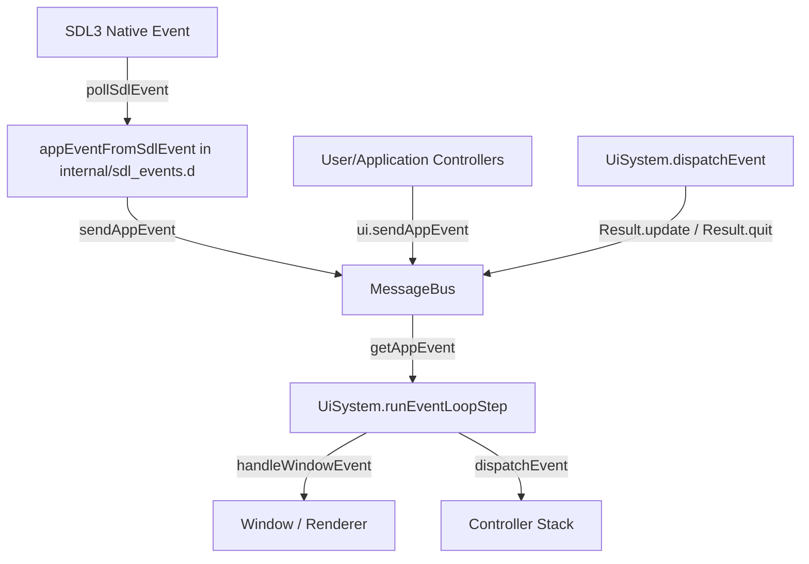

# Plan: Document `AppEvent` Lifecycles & Propose Refactoring (SumType / Union)

## Goal Description
In [`yguilib/source/yguilib/events/package.d`](file:///home/yur/agy-projects/yvidtrim/yguilib/source/yguilib/events/package.d):
1. **Lifecycle & Origin Documentation**: Analyze how and when `AppEvent` instances are created across the application and UI system.
2. **Field Validity Documentation**: Add clear doc-comments to every single field in `struct AppEvent` specifying under which event kinds (`AppEvent.Kind`) each field is populated and valid.
3. **Refactoring Proposal**: Suggest concrete refactoring options for `AppEvent` using:
   - **Option A**: `std.sumtype` (idiomatic D tagged union with pattern matching via `match!`).
   - **Option B**: Manual tagged union (`union Data` + `Kind kind`).
   - Comparison of trade-offs (type safety, memory footprint, ergonomics, ABI/C-interop, code migration cost).

---

## Analysis: How and When `AppEvent` is Created

`AppEvent` is currently a flat "fat struct" containing fields for all possible event types (window, mouse, keyboard, text input, user/view events, and engine tick).

### Creation Points in Codebase:



1. **Native SDL3 Event Translation** ([`yguilib/source/yguilib/events/internal/sdl_events.d`](file:///home/yur/agy-projects/yvidtrim/yguilib/source/yguilib/events/internal/sdl_events.d#L10)):
   - **`Kind.appQuit`**: Created when SDL emits `SDL_EVENT_QUIT`.
   - **`Kind.windowClose`**: Created on `SDL_EVENT_WINDOW_CLOSE_REQUESTED`.
   - **`Kind.windowResized`**: Created on `SDL_EVENT_WINDOW_RESIZED` or pixel-size change.
   - **`Kind.windowExposed`**: Created on `SDL_EVENT_WINDOW_EXPOSED`.
   - **`Kind.windowDisplayScaleChanged`**: Created on `SDL_EVENT_WINDOW_DISPLAY_SCALE_CHANGED`.
   - **`Kind.mouseMotion`**: Created on `SDL_EVENT_MOUSE_MOTION`.
   - **`Kind.mouseButtonDown`**: Created on `SDL_EVENT_MOUSE_BUTTON_DOWN`.
   - **`Kind.mouseButtonUp`**: Created on `SDL_EVENT_MOUSE_BUTTON_UP`.
   - **`Kind.keyDown`**: Created on `SDL_EVENT_KEY_DOWN`.
   - **`Kind.keyUp`**: Created on `SDL_EVENT_KEY_UP`.
   - **`Kind.textEditing`**: Created on `SDL_EVENT_TEXT_EDITING` (IME composition).
   - **`Kind.textInput`**: Created on `SDL_EVENT_TEXT_INPUT`.

2. **UI Framework & Controllers** ([`yguilib/source/yguilib/uisystem.d`](file:///home/yur/agy-projects/yvidtrim/yguilib/source/yguilib/uisystem.d)):
   - **`Kind.update`**: Dispatched by `UiSystem.dispatchEvent` when a controller returns `HandleResult.Result.update`.
   - **`Kind.user`**: Created directly by client code / controllers via `AppEvent(AppEvent.Kind.user, eventId, ...)` or `sendAppEvent(...)` for custom messages.
   - **`Kind.view`**: Reserved for UI control / widget events.
   - **`Kind.windowRedraw`**: Declared in enum for synthetic redraw triggers.

---

## Field Validity Mapping

| Field | Type | Default | Valid / Populated In Kinds | Meaning / Details |
|---|---|---|---|---|
| `kind` | `Kind` | N/A | **All events** | Discriminator identifying the event variant. |
| `eventId` | `uint` | `0` | `Kind.user`, `Kind.view` | Custom action or user-defined message identifier. |
| `windowId` | `uint` | `0` | `Kind.window*`, `Kind.mouse*`, `Kind.key*`, `Kind.text*` | SDL window ID targeted by this event (`0` = all/any). |
| `width` | `int` | `0` | `Kind.windowResized`, `Kind.windowExposed`, `Kind.windowDisplayScaleChanged` | New window pixel width. |
| `height` | `int` | `0` | `Kind.windowResized`, `Kind.windowExposed`, `Kind.windowDisplayScaleChanged` | New window pixel height. |
| `data` | `Object` | `null` | `Kind.user`, `Kind.view` | Optional custom payload object passed with user/view events. |
| `x` | `float` | `0.0f` | `Kind.mouseMotion`, `Kind.mouseButtonDown`, `Kind.mouseButtonUp` | Window-relative mouse X coordinate (in points/pixels). |
| `y` | `float` | `0.0f` | `Kind.mouseMotion`, `Kind.mouseButtonDown`, `Kind.mouseButtonUp` | Window-relative mouse Y coordinate (in points/pixels). |
| `scale` | `float` | `1.0f` | `Kind.windowResized`, `Kind.windowDisplayScaleChanged` | DPI / display scaling factor (e.g. 1.0, 1.25, 2.0). |
| `key` | `Keycode` | `Keycode.init` | `Kind.keyDown`, `Kind.keyUp` | Virtual keycode (layout-dependent character code). |
| `scancode` | `Scancode` | `Scancode.init` | `Kind.keyDown`, `Kind.keyUp` | Physical scancode (hardware key position). |
| `mod` | `ushort` | `0` | `Kind.keyDown`, `Kind.keyUp` | Bitmask of active modifier keys (Shift, Ctrl, Alt, Gui). |
| `repeat` | `bool` | `false` | `Kind.keyDown` | `true` if key event is an automatic key-repeat from holding down. |
| `text` | `string` | `null` | `Kind.textInput`, `Kind.textEditing` | UTF-8 text entered or IME candidate preview. |
| `editStart` | `int` | `0` | `Kind.textEditing` | Cursor selection start offset within candidate IME text. |
| `editLength` | `int` | `0` | `Kind.textEditing` | Selected text length within candidate IME text. |

---

## Proposed Changes to `yguilib/source/yguilib/events/package.d`

Add documentation comments for each field adhering to `codestyle.md` (max 80 chars, LF):

```d
/// Current and up the stack controllers decide what events are consumed,
/// which propagated up the controller stack.
struct AppEvent {
  enum Kind {
    /// Controller should execute periodic/frame update logic.
    update,
    /// User-defined application events.
    user,
    /// Events produced by UI controls/widgets.
    view,
    /// Window close request.
    windowClose,
    /// Window size changed.
    windowResized,
    /// Window exposed / damage region needs redraw.
    windowExposed,
    /// Display DPI scale changed.
    windowDisplayScaleChanged,
    /// Explicit window redraw requested.
    windowRedraw,
    /// Mouse cursor moved.
    mouseMotion,
    /// Mouse button pressed.
    mouseButtonDown,
    /// Mouse button released.
    mouseButtonUp,
    /// Keyboard key pressed.
    keyDown,
    /// Keyboard key released.
    keyUp,
    /// Text composition/editing state in progress (IME).
    textEditing,
    /// Final text input committed.
    textInput,
    /// Application quit requested.
    appQuit,
  }

  /// Event type discriminator. Valid for all events.
  Kind kind;

  /// Custom event identifier.
  /// Valid when: `kind == Kind.user` or `kind == Kind.view`.
  uint eventId = 0;

  /// Target window identifier (0 matches any window).
  /// Valid when: window, mouse, keyboard, or text events.
  uint windowId = 0;

  /// New pixel width of the window.
  /// Valid when: `kind == Kind.windowResized`, `Kind.windowExposed`,
  /// or `Kind.windowDisplayScaleChanged`.
  int width = 0;

  /// New pixel height of the window.
  /// Valid when: `kind == Kind.windowResized`, `Kind.windowExposed`,
  /// or `Kind.windowDisplayScaleChanged`.
  int height = 0;

  /// Optional user-defined payload object.
  /// Valid when: `kind == Kind.user` or `kind == Kind.view`.
  Object data = null;

  /// Window-relative horizontal position.
  /// Valid when: `kind == Kind.mouseMotion`, `Kind.mouseButtonDown`,
  /// or `Kind.mouseButtonUp`.
  float x = 0.0f;

  /// Window-relative vertical position.
  /// Valid when: `kind == Kind.mouseMotion`, `Kind.mouseButtonDown`,
  /// or `Kind.mouseButtonUp`.
  float y = 0.0f;

  /// Display DPI scale factor.
  /// Valid when: `kind == Kind.windowDisplayScaleChanged` or
  /// `Kind.windowResized`.
  float scale = 1.0f;

  /// Virtual key code (layout-dependent).
  /// Valid when: `kind == Kind.keyDown` or `Kind.keyUp`.
  Keycode key;

  /// Physical hardware scancode (layout-independent).
  /// Valid when: `kind == Kind.keyDown` or `Kind.keyUp`.
  Scancode scancode;

  /// Key modifier bitmask (SDL_Keymod e.g. Shift, Ctrl, Alt).
  /// Valid when: `kind == Kind.keyDown` or `Kind.keyUp`.
  ushort mod = 0;

  /// True if key down was generated by keyboard auto-repeat.
  /// Valid when: `kind == Kind.keyDown`.
  bool repeat = false;

  /// UTF-8 input string or IME composition text.
  /// Valid when: `kind == Kind.textInput` or `Kind.textEditing`.
  string text = null;

  /// Composition cursor start position inside `text`.
  /// Valid when: `kind == Kind.textEditing`.
  int editStart = 0;

  /// Composition selection length inside `text`.
  /// Valid when: `kind == Kind.textEditing`.
  int editLength = 0;
```

---

## Refactoring Suggestions: SumType vs. Union

Currently, `AppEvent.sizeof` is 80 bytes on x86_64, where each event carries unused fields (e.g. mouse events carry strings and keycodes; tick events carry 76 bytes of unused fields).

### Option 1: `std.sumtype` (Standard D Tagged Union)

In Phobos (`std.sumtype`), each event kind is represented as an explicit payload struct:

```d
module yguilib.events;

import std.sumtype : SumType, match;
public import yguilib.events.keyboard : Keycode, Scancode;

struct WindowCloseEvent { uint windowId; }
struct WindowResizeEvent { uint windowId; int width; int height; float scale = 1.0f; }
struct WindowExposeEvent { uint windowId; int width; int height; }
struct WindowScaleEvent { uint windowId; float scale; int width; int height; }
struct WindowRedrawEvent { uint windowId; }

struct MouseMotionEvent { uint windowId; float x; float y; }
struct MouseButtonDownEvent { uint windowId; float x; float y; }
struct MouseButtonUpEvent { uint windowId; float x; float y; }

struct KeyDownEvent { uint windowId; Keycode key; Scancode scancode; ushort mod; bool repeat; }
struct KeyUpEvent { uint windowId; Keycode key; Scancode scancode; ushort mod; }

struct TextInputEvent { uint windowId; string text; }
struct TextEditingEvent { uint windowId; string text; int editStart; int editLength; }

struct UserEvent { uint eventId; Object data; }
struct ViewEvent { uint eventId; Object data; }
struct UpdateEvent {}
struct AppQuitEvent {}

alias AppEvent = SumType!(
  UpdateEvent,
  UserEvent,
  ViewEvent,
  WindowCloseEvent,
  WindowResizeEvent,
  WindowExposeEvent,
  WindowScaleEvent,
  WindowRedrawEvent,
  MouseMotionEvent,
  MouseButtonDownEvent,
  MouseButtonUpEvent,
  KeyDownEvent,
  KeyUpEvent,
  TextEditingEvent,
  TextInputEvent,
  AppQuitEvent
);
```

#### Usage with `match`:
```d
ev.match!(
  (in KeyDownEvent e) {
    if (e.key == Keycode.q) sendQuit();
  },
  (in MouseButtonDownEvent e) {
    handleClick(e.x, e.y);
  },
  (_) {} // default / unhandled
);
```

#### Pros:
- **Type Safety**: Impossible to access `editLength` or `text` on a `MouseMotionEvent`.
- **Exhaustiveness Checking**: Compiler checks that all branches are handled if no fallback `_` is provided.
- **Payload-specific constructors**: Only initialize fields that actually belong to the event.

#### Cons:
- Breaking API change for existing code doing `if (ev.kind == AppEvent.Kind.keyDown)`.
- Slight template code bloat / compilation time overhead if many `match` lambdas are instantiated.

---

### Option 2: C-Style Tagged Union (`Kind` + `union Data`)

```d
struct AppEvent {
  enum Kind { ... }

  struct WindowData { uint windowId; int width; int height; float scale; }
  struct MouseData { uint windowId; float x; float y; }
  struct KeyData { uint windowId; Keycode key; Scancode scancode; ushort mod; bool repeat; }
  struct TextData { uint windowId; string text; int editStart; int editLength; }
  struct UserData { uint eventId; Object data; }

  Kind kind;
  union {
    WindowData window;
    MouseData mouse;
    KeyData key;
    TextData text;
    UserData user;
  }
}
```

#### Pros:
- Lower memory footprint (~32-40 bytes instead of 80 bytes).
- Standard imperative `switch (ev.kind)` remains compatible.
- Fast compilation without template instantiations.

#### Cons:
- Not memory-safe (`@safe` restrictions on unions containing pointers/strings like `text` and `Object data`).
- Field names change slightly (e.g. `ev.mouse.x` vs `ev.x`), requiring migration across callers.

---

### Option 3: Non-breaking Migration via `SumType` with Backward Compatibility Getters

If immediate migration without breaking callers is preferred, `AppEvent` can wrap the `SumType` or union, while providing convenience getters or property delegates for `kind`, `x`, `y`, `key`, etc.

---

## Verification Plan

### Automated Checks:
1. Check line length on modified `yguilib/source/yguilib/events/package.d`:
   ```bash
   rdmd .agents/skills/check-line-length/scripts/check_line_length.d yguilib/source/yguilib/events/package.d
   ```
2. Check codestyle rules:
   ```bash
   rdmd .agents/skills/check-codestyle/scripts/check_codestyle.d yguilib/source/yguilib/events/package.d
   ```
3. Build and test:
   ```bash
   ninja -C _build
   ```
