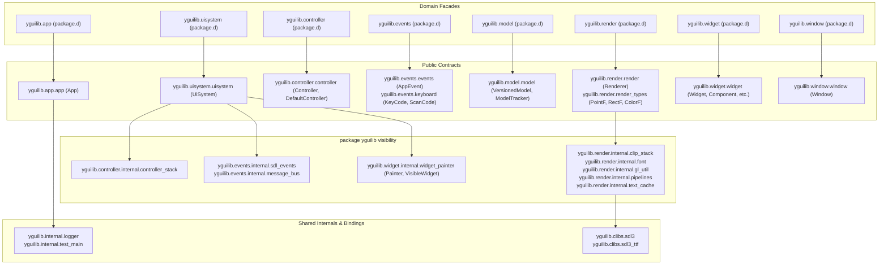

# Outdated! Refactoring Plan: Decoupled Modular Architecture with Internal Packages and Domain Facades

## Goal Description
Refactor the D codebase in `yguilib/source` to adhere strictly to the architecture and module visibility guidelines established in `codestyle.md`:
- Eliminate monolithic/flat module structures in favor of distinct domain subsystems.
- For each domain, establish a strict directory layout:
  ```
  yguilib/source/yguilib/<domain>/
  ├── package.d
  ├── <public_contract_modules>.d
  └── internal/
      └── <implementation_modules>.d
  ```
- Establish `yguilib/source/yguilib/internal/` for shared, cross-cutting private helpers (logging, test runner).
- Convert `yguilib/source/yguilib/priv/` into domain-specific `internal/` packages or shared `internal/`.
- Ensure no monolithic root `yguilib/package.d` exists that re-exports the whole library; consumers must selectively import domain packages (e.g., `import yguilib.render;`, `import yguilib.events;`).
- In each domain's `package.d`, use selective `public import` declarations (e.g., `public import yguilib.render.render : Renderer;`).
- Restrict visibility of internal functions, structs, and drivers using `package(yguilib)` or file-level `private`.
- Optimize compile-time overhead by moving heavy file-level imports (e.g. `std.logger`, `std.algorithm`, `std.string`) inside method/function scopes.
- Update `yguilib/meson.build`, all internal cross-module references, and `source/yvidtrim/app.d` to match the new module paths.



---

## User Review Required

> [!IMPORTANT]
> **Domain Splitting for `app` and `uisystem`**:
> We propose keeping `yguilib.app` (containing `App`) and `yguilib.uisystem`
> (containing `UiSystem`) as distinct domain packages with their own
> `package.d` facades. This matches `gui-overview.adoc` where the UI System is
> a distinct major component orchestrating event dispatch and widgets, while
> `App` is the top-level application lifecycle container.

> [!NOTE]
> **Consolidation of `render_types` and `keyboard`**:
> - `render_types` moves to `yguilib.render.render_types` and is selectively
>   re-exported via `yguilib.render` (`PointF`, `RectF`, `ColorF`, `Color`,
>   `intersectRects`).
> - `keyboard` moves to `yguilib.events.keyboard` and is selectively re-exported
>   via `yguilib.events` (`KeyCode`, `ScanCode`).
> Consumers can now import just `yguilib.render` and `yguilib.events` instead of
> having fragmented top-level modules.

> [!NOTE]
> **C Library Bindings (`yguilib/clibs/`)**:
> In accordance with `AGENTS.md` ("D Bindings: Put matching extern(C) in ...
> `yguilib/source/yguilib/clibs/<libname>.d`"), the files remain located under
> `yguilib/source/yguilib/clibs/`. To enforce internal access control, we add
> `package(yguilib):` visibility to `sdl3.d` and `sdl3_ttf.d`, preventing
> external consumers (like `yvidtrim`) from accessing private wrapper symbols.

---

## Open Questions
- None at this time. All requirements match `codestyle.md` and `AGENTS.md`.

---

## Proposed Changes

### Domain Reorganization & File Layout

| Domain | Files / Roles | New Path | Old Path |
|---|---|---|---|
| **Shared Internals** | Cross-cutting logger | `yguilib/source/yguilib/internal/logger.d` | `yguilib/source/yguilib/priv/logger.d` |
| | Unittest entry point | `yguilib/source/yguilib/internal/test_main.d` | `yguilib/source/yguilib/priv/test_main.d` |
| **C Bindings** | SDL3 C wrapper binding | `yguilib/source/yguilib/clibs/sdl3.d` | Unchanged path, package(yguilib) access |
| | SDL3_ttf C wrapper binding | `yguilib/source/yguilib/clibs/sdl3_ttf.d` | Unchanged path, package(yguilib) access |
| **model** | Domain facade | `yguilib/source/yguilib/model/package.d` | **NEW** |
| | Versioned model & tracker | `yguilib/source/yguilib/model/model.d` | `yguilib/source/yguilib/model.d` |
| **events** | Domain facade | `yguilib/source/yguilib/events/package.d` | **NEW** |
| | AppEvent contract | `yguilib/source/yguilib/events/events.d` | `yguilib/source/yguilib/events.d` |
| | KeyCode & ScanCode contract | `yguilib/source/yguilib/events/keyboard.d` | `yguilib/source/yguilib/keyboard.d` |
| | Internal SDL event translation | `yguilib/source/yguilib/events/internal/sdl_events.d` | `yguilib/source/yguilib/priv/sdl_events.d` |
| | Internal thread-safe message bus | `yguilib/source/yguilib/events/internal/message_bus.d` | `yguilib/source/yguilib/priv/message_bus.d` |
| **controller** | Domain facade | `yguilib/source/yguilib/controller/package.d` | **NEW** |
| | Controller contracts | `yguilib/source/yguilib/controller/controller.d` | `yguilib/source/yguilib/controller.d` |
| | Internal controller stack | `yguilib/source/yguilib/controller/internal/controller_stack.d` | `yguilib/source/yguilib/priv/controller_stack.d` |
| **window** | Domain facade | `yguilib/source/yguilib/window/package.d` | **NEW** |
| | Window contract | `yguilib/source/yguilib/window/window.d` | `yguilib/source/yguilib/window.d` |
| **render** | Domain facade | `yguilib/source/yguilib/render/package.d` | **NEW** |
| | Renderer contract | `yguilib/source/yguilib/render/render.d` | `yguilib/source/yguilib/render.d` |
| | Render types & math contract | `yguilib/source/yguilib/render/render_types.d` | `yguilib/source/yguilib/render_types.d` |
| | Internal clip stack | `yguilib/source/yguilib/render/internal/clip_stack.d` | `yguilib/source/yguilib/priv/render/clip_stack.d` |
| | Internal font rasterizer | `yguilib/source/yguilib/render/internal/font.d` | `yguilib/source/yguilib/priv/render/font.d` |
| | Internal GL utility functions | `yguilib/source/yguilib/render/internal/gl_util.d` | `yguilib/source/yguilib/priv/render/gl_util.d` |
| | Internal shader pipelines | `yguilib/source/yguilib/render/internal/pipelines.d` | `yguilib/source/yguilib/priv/render/pipelines.d` |
| | Internal text cache | `yguilib/source/yguilib/render/internal/text_cache.d` | `yguilib/source/yguilib/priv/render/text_cache.d` |
| **widget** | Domain facade | `yguilib/source/yguilib/widget/package.d` | **NEW** |
| | Widget & component contracts | `yguilib/source/yguilib/widget/widget.d` | `yguilib/source/yguilib/widget.d` |
| | Internal widget painter & VisibleWidget | `yguilib/source/yguilib/widget/internal/widget_painter.d` | `yguilib/source/yguilib/priv/widget_painter.d` |
| **uisystem** | Domain facade | `yguilib/source/yguilib/uisystem/package.d` | **NEW** |
| | UiSystem contract | `yguilib/source/yguilib/uisystem/uisystem.d` | `yguilib/source/yguilib/uisystem.d` |
| **app** | Domain facade | `yguilib/source/yguilib/app/package.d` | **NEW** |
| | App contract | `yguilib/source/yguilib/app/app.d` | `yguilib/source/yguilib/app.d` |

---

### Component Details

#### 1. Domain: `yguilib.model`
- **`package.d`**:
  ```d
  module yguilib.model;
  public import yguilib.model.model :
    ModelTracker,
    ModelVersion,
    VersionedModel;
  ```
- **`model.d`**:
  Module declaration: `module yguilib.model.model;`

#### 2. Domain: `yguilib.events`
- **`package.d`**:
  ```d
  module yguilib.events;
  public import yguilib.events.events : AppEvent;
  public import yguilib.events.keyboard : KeyCode, ScanCode;
  ```
- **`events.d`**:
  Module declaration: `module yguilib.events.events;`
  Imports: `import yguilib.events.keyboard;`
- **`keyboard.d`**:
  Module declaration: `module yguilib.events.keyboard;`
  Imports: `import yguilib.clibs.sdl3;`
- **`internal/sdl_events.d`**:
  Module declaration: `module yguilib.events.internal.sdl_events;`
  Access: `package(yguilib):`
  Scoped imports: `std.typecons : Nullable;`
- **`internal/message_bus.d`**:
  Module declaration: `module yguilib.events.internal.message_bus;`
  Access: `package(yguilib):`
  Imports: `yguilib.events.events : AppEvent;`, `yguilib.clibs.sdl3;`

#### 3. Domain: `yguilib.controller`
- **`package.d`**:
  ```d
  module yguilib.controller;
  public import yguilib.controller.controller :
    Controller,
    DefaultController;
  ```
- **`controller.d`**:
  Module declaration: `module yguilib.controller.controller;`
  Imports: `import yguilib.events.events : AppEvent;`
- **`internal/controller_stack.d`**:
  Module declaration: `module yguilib.controller.internal.controller_stack;`
  Access: `package(yguilib):`
  Imports: `import yguilib.controller.controller : Controller;`

#### 4. Domain: `yguilib.window`
- **`package.d`**:
  ```d
  module yguilib.window;
  public import yguilib.window.window : Window;
  ```
- **`window.d`**:
  Module declaration: `module yguilib.window.window;`
  Imports:
  `import yguilib.render : RectF, Renderer;`
  `import yguilib.widget : Widget;`
  `import yguilib.events : AppEvent;`
  `import yguilib.clibs.sdl3;`
  Scoped import for `std.string : toStringz;` inside `create()`.

#### 5. Domain: `yguilib.render`
- **`package.d`**:
  ```d
  module yguilib.render;
  public import yguilib.render.render : Renderer;
  public import yguilib.render.render_types :
    Color,
    ColorF,
    PointF,
    RectF,
    intersectRects;
  public import yguilib.render.internal.font : Font;
  ```
- **`render.d`**:
  Module declaration: `module yguilib.render.render;`
  Imports:
  `import yguilib.render.render_types;`
  `import yguilib.render.internal.clip_stack : ClipStack;`
  `import yguilib.render.internal.pipelines : ColorPipeline,`
    `RoundRectPipeline, TexturePipeline;`
  `import yguilib.render.internal.text_cache : TextCache, TextTexture;`
  `import yguilib.events : AppEvent;`
  Scoped imports for `std.logger`, `std.algorithm : min, max;`.
- **`render_types.d`**:
  Module declaration: `module yguilib.render.render_types;`
  Scoped imports: `std.algorithm : min, max;` inside `intersectRects`.
- **`internal/clip_stack.d`**:
  Module declaration: `module yguilib.render.internal.clip_stack;`
  Access: `package(yguilib):`
  Imports: `import yguilib.render.render_types : RectF, intersectRects;`
- **`internal/font.d`**:
  Module declaration: `module yguilib.render.internal.font;`
  Access: `package(yguilib):` (except `Font` class which is selectively
  re-exported via facade).
- **`internal/gl_util.d`**:
  Module declaration: `module yguilib.render.internal.gl_util;`
  Access: `package(yguilib):`
  Scoped imports: `std.logger` inside `compileShader`.
- **`internal/pipelines.d`**:
  Module declaration: `module yguilib.render.internal.pipelines;`
  Access: `package(yguilib):`
  Imports: `import yguilib.render.internal.gl_util;`
- **`internal/text_cache.d`**:
  Module declaration: `module yguilib.render.internal.text_cache;`
  Access: `package(yguilib):`
  Imports: `import yguilib.render.internal.font : Font;`

#### 6. Domain: `yguilib.widget`
- **`package.d`**:
  ```d
  module yguilib.widget;
  public import yguilib.widget.widget :
    Background,
    Border,
    Component,
    CustomDraw,
    DefaultButton,
    Focus,
    InputEnabled,
    KeyboardAction,
    TextLabel,
    View,
    Widget,
    WidgetComponents;
  ```
- **`widget.d`**:
  Module declaration: `module yguilib.widget.widget;`
  Imports: `import yguilib.render : ColorF, PointF, RectF, Renderer;`
  Remove `VisibleWidget` struct (moved to `internal/widget_painter.d`).
- **`internal/widget_painter.d`**:
  Module declaration: `module yguilib.widget.internal.widget_painter;`
  Access: `package(yguilib):`
  Contains `struct VisibleWidget` (encapsulated) and
  `final class WidgetPainterSystem`.
  Imports:
  `import yguilib.widget.widget : Background, Border, TextLabel, Widget;`
  `import yguilib.render : PointF, RectF, Renderer, intersectRects;`

#### 7. Domain: `yguilib.uisystem`
- **`package.d`**:
  ```d
  module yguilib.uisystem;
  public import yguilib.uisystem.uisystem : UiSystem;
  ```
- **`uisystem.d`**:
  Module declaration: `module yguilib.uisystem.uisystem;`
  Imports:
  `import yguilib.controller : Controller;`
  `import yguilib.controller.internal.controller_stack : ControllerStack;`
  `import yguilib.events : AppEvent, KeyCode, ScanCode;`
  `import yguilib.events.internal.message_bus : MessageBus;`
  `import yguilib.events.internal.sdl_events : appEventFromSdlEvent;`
  `import yguilib.widget.internal.widget_painter : WidgetPainterSystem;`
  `import yguilib.render : Renderer;`
  `import yguilib.widget : Widget;`
  `import yguilib.window : Window;`
  `import yguilib.clibs.sdl3;`

#### 8. Domain: `yguilib.app`
- **`package.d`**:
  ```d
  module yguilib.app;
  public import yguilib.app.app : App;
  ```
- **`app.d`**:
  Module declaration: `module yguilib.app.app;`
  Imports:
  `import yguilib.uisystem : UiSystem;`
  `import yguilib.controller : Controller;`
  `import yguilib.window : Window;`
  `import yguilib.internal.logger : setupSdlLogger;`

#### 9. Shared Internals & C Bindings
- **`yguilib/source/yguilib/internal/logger.d`**:
  Module: `module yguilib.internal.logger;`
  Access: `package(yguilib):`
  Imports: `import yguilib.clibs.sdl3;`
  Scoped: `std.string : toStringz;` inside `writeLogMsg()`.
- **`yguilib/source/yguilib/internal/test_main.d`**:
  Module: `module yguilib.internal.test_main;`
- **`yguilib/source/yguilib/clibs/sdl3.d`**:
  Set top-level `package(yguilib):` visibility to encapsulate C bindings.
- **`yguilib/source/yguilib/clibs/sdl3_ttf.d`**:
  Set top-level `package(yguilib):` visibility to encapsulate C bindings.

#### 10. Build Configuration & Downstream Code
- **`yguilib/meson.build`**:
  Update `yguilib_src` list to reflect the new file layout.
  Update `yguilib_test_src` to reference `source/yguilib/internal/test_main.d`.
- **`source/yvidtrim/app.d`**:
  Update imports to use facades:
  ```d
  import yguilib.app;
  import yguilib.controller;
  import yguilib.events;
  import yguilib.uisystem;
  import yguilib.widget;
  import yguilib.render;
  import yguilib.window;
  import yguilib.model;
  ```
  Remove redundant `import yguilib.render_types;` and
  `import yguilib.keyboard;`.
- Remove leftover editor backups (`*~`).

---

## Verification Plan

### Automated Tests
1. **Compilation & Build**:
   ```bash
   ninja -C _build
   ```
2. **Project Test Suite**:
   ```bash
   meson test -C _build
   ```
   Ensures all 5 test suites pass:
   - `yvidtrim_sdl3`
   - `yguilib_sdl3_ttf`
   - `glad2gles31d`
   - `yguilib_sdl3`
   - `yguilib_test` (includes all widget, painter, render, window, model,
     and event unittests)
3. **Style & Line Length Check**:
   ```bash
   rdmd .agents/skills/check-line-length/scripts/check_line_length.d
   ```

### Manual Verification
- Run `./_build/yvidtrim` to verify the application starts, renders UI elements
  (background, dashed rounded border, text label), handles key events ('q'
  to quit), and exits cleanly.
