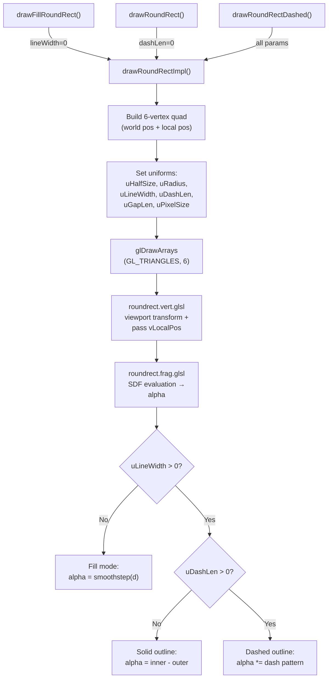

# SDF Rounded Rectangle Drawing Functions

## Goal

Add three new public drawing methods to [`Renderer`](file://../yguilib/source/yguilib/render.d#L196) in yguilib:

| Method | Purpose |
|---|---|
| `drawFillRoundRect(RectF, float radius, ColorF)` | Filled rounded rectangle |
| `drawRoundRect(RectF, float radius, float lineWidth, ColorF)` | Outlined rounded rectangle with configurable thickness |
| `drawRoundRectDashed(RectF, float radius, float lineWidth, float dashLen, float gapLen, ColorF)` | Dashed-outline rounded rectangle |

All three use a **single new SDF (Signed Distance Field) shader program** that computes rounded-rect geometry entirely in the fragment shader — no CPU-side tessellation or triangle fan needed. This gives resolution-independent, perfectly anti-aliased corners at any scale.

## Design Decisions

> [!IMPORTANT]
> **Single shader for all three modes** — The fragment shader uses uniforms to switch between fill, solid-outline, and dashed-outline modes. This avoids compiling three separate shader programs while keeping the shader simple.

> [!NOTE]
> **Coordinate system** — Like existing draw methods, all parameters are in **logic-space units** (pre-scaling). The shader receives the rect in logic coordinates and `uResolution` handles the viewport transform, consistent with `drawFillRect` / `drawRect`.

> [!NOTE]
> **Anti-aliasing** — The SDF approach gives us 1-pixel smooth edges via `smoothstep`. This is a significant visual improvement over the existing `GL_LINE_LOOP`-based `drawRect` which produces aliased 1px outlines.

## Proposed Changes

### Shaders

#### [NEW] `roundrect.vert.glsl`

Vertex shader for the rounded rect program. Same structure as the existing [`color.vert.glsl`](file://../yguilib/assets/yguilib/shaders/color.vert.glsl) but adds a `vLocalPos` varying that passes the local-space fragment coordinate for SDF evaluation:

```glsl
/**
 * Vertex shader for SDF rounded rectangle rendering.
 *
 * Vertex data layout: [worldX, worldY, localX, localY] per vertex (4 floats/vertex, 6 vertices per quad).
 * `aPosition`: Screen/viewport coordinate in logical units.
 * `aLocalPos`: Local coordinate relative to rectangle center in logical units
 *              ranging in (-halfW..+halfW, -halfH..+halfH).
 */
#version 300 es

layout(location = 0) in vec2 aPosition;
layout(location = 1) in vec2 aLocalPos;
uniform vec2 uResolution;
out vec2 vLocalPos;

void main() {
  vec2 zeroToOne = aPosition / uResolution;
  vec2 zeroToTwo = zeroToOne * 2.0;
  vec2 clipSpace = vec2(zeroToTwo.x - 1.0, 1.0 - zeroToTwo.y);
  gl_Position = vec4(clipSpace, 0.0, 1.0);
  vLocalPos = aLocalPos;
}
```

The vertex data layout is `[worldX, worldY, localX, localY]` per vertex — 4 floats/vertex, 6 vertices per quad. `aLocalPos` maps `(-halfW..+halfW, -halfH..+halfH)` so the SDF is evaluated relative to the rect center.

---

#### [NEW] `roundrect.frag.glsl`

Fragment shader implementing the SDF rounded rect with three modes:

```glsl
#version 300 es

precision highp float;

uniform vec4 uColor;
uniform vec2 uHalfSize;   // half-width, half-height of the rect
uniform float uRadius;    // corner radius (clamped to min half-dim)
uniform float uLineWidth; // 0.0 = fill mode, >0 = outline mode
uniform float uDashLen;   // dash length (0.0 = solid)
uniform float uGapLen;    // gap length  (0.0 = solid)
uniform float uPixelSize; // 1.0 / totalScaling — for AA smoothstep

in vec2 vLocalPos;
out vec4 fragColor;

float sdRoundBox(vec2 p, vec2 b, float r) {
  vec2 q = abs(p) - b + r;
  return length(max(q, 0.0)) + min(max(q.x, q.y), 0.0) - r;
}

void main() {
  float d = sdRoundBox(vLocalPos, uHalfSize, uRadius);

  float aa = uPixelSize * 1.0;
  float alpha;

  if (uLineWidth > 0.0) {
    // Outline mode: band between d = -lineWidth and d = 0
    float outer = 1.0 - smoothstep(-aa, aa, d);
    float inner = 1.0 - smoothstep(-aa, aa, d + uLineWidth);
    alpha = inner - outer;

    // Dashed mode
    if (uDashLen > 0.0 && uGapLen > 0.0) {
      // Compute arc-length-like parameter along the border
      // Use atan2 relative to center, scaled by perimeter
      float angle = atan(vLocalPos.y, vLocalPos.x);
      // Approximate perimeter position
      float perim = (uHalfSize.x + uHalfSize.y) * 2.0;
      float t = (angle + 3.14159265) / 6.28318530 * perim;
      float period = uDashLen + uGapLen;
      float phase = mod(t, period);
      // Smooth dash edges
      float dashAlpha = smoothstep(0.0, aa, phase)
        * (1.0 - smoothstep(uDashLen - aa, uDashLen, phase));
      alpha *= dashAlpha;
    }
  } else {
    // Fill mode
    alpha = 1.0 - smoothstep(-aa, aa, d);
  }

  if (alpha <= 0.0) discard;
  fragColor = vec4(uColor.rgb, uColor.a * alpha);
}
```

**Key SDF formula**: `sdRoundBox` returns negative values inside the shape, zero on the boundary, positive outside. This is the standard [Inigo Quilez rounded box SDF](https://iquilezles.org/articles/distfunctions2d/).

---

### Renderer D Code

#### [MODIFY] [render.d](file://../yguilib/source/yguilib/render.d)

**1. Add shader initialization** — in [`initialize()`](file://..//yguilib/source/yguilib/render.d#L205) after the texture program block (line ~293), add a third shader program block:

```d
    // --- Round rect SDF shader program ---
    enum string rrVertSource =
      import("yguilib/shaders/roundrect.vert.glsl");
    enum string rrFragSource =
      import("yguilib/shaders/roundrect.frag.glsl");

    GLuint rrVert = compileShader(GL_VERTEX_SHADER, rrVertSource);
    scope(exit) glDeleteShader(rrVert);

    GLuint rrFrag = compileShader(GL_FRAGMENT_SHADER, rrFragSource);
    scope(exit) glDeleteShader(rrFrag);

    rrProgram = linkProgram(rrVert, rrFrag);
    uRrResolutionLoc =
      glGetUniformLocation(rrProgram, "uResolution\0".ptr);
    uRrColorLoc =
      glGetUniformLocation(rrProgram, "uColor\0".ptr);
    uRrHalfSizeLoc =
      glGetUniformLocation(rrProgram, "uHalfSize\0".ptr);
    uRrRadiusLoc =
      glGetUniformLocation(rrProgram, "uRadius\0".ptr);
    uRrLineWidthLoc =
      glGetUniformLocation(rrProgram, "uLineWidth\0".ptr);
    uRrDashLenLoc =
      glGetUniformLocation(rrProgram, "uDashLen\0".ptr);
    uRrGapLenLoc =
      glGetUniformLocation(rrProgram, "uGapLen\0".ptr);
    uRrPixelSizeLoc =
      glGetUniformLocation(rrProgram, "uPixelSize\0".ptr);

    glGenVertexArrays(1, &rrVao);
    glBindVertexArray(rrVao);

    glGenBuffers(1, &rrVbo);
    glBindBuffer(GL_ARRAY_BUFFER, rrVbo);

    // aPosition (location 0)
    glEnableVertexAttribArray(0);
    glVertexAttribPointer(
      0, 2, GL_FLOAT, GL_FALSE,
      4 * float.sizeof, null
    );
    // aLocalPos (location 1)
    glEnableVertexAttribArray(1);
    glVertexAttribPointer(
      1, 2, GL_FLOAT, GL_FALSE,
      4 * float.sizeof,
      cast(const(void)*)(2 * float.sizeof)
    );

    glBindVertexArray(0);
    glBindBuffer(GL_ARRAY_BUFFER, 0);
```

**2. Add cleanup** — in [`destroy()`](file://..//yguilib/source/yguilib/render.d#L298), before the `clipStack` cleanup:

```d
    if (rrVbo != 0) {
      glDeleteBuffers(1, &rrVbo);
      rrVbo = 0;
    }
    if (rrVao != 0) {
      glDeleteVertexArrays(1, &rrVao);
      rrVao = 0;
    }
    if (rrProgram != 0) {
      glDeleteProgram(rrProgram);
      rrProgram = 0;
    }
```

**3. Add private fields** — in the private section (after line ~965):

```d
  GLuint rrProgram;
  GLuint rrVao;
  GLuint rrVbo;
  GLint uRrResolutionLoc = -1;
  GLint uRrColorLoc = -1;
  GLint uRrHalfSizeLoc = -1;
  GLint uRrRadiusLoc = -1;
  GLint uRrLineWidthLoc = -1;
  GLint uRrDashLenLoc = -1;
  GLint uRrGapLenLoc = -1;
  GLint uRrPixelSizeLoc = -1;
```

**4. Add core private helper** — in the private section, a single internal method that all three public methods delegate to:

```d
  private void drawRoundRectImpl(
    RectF rect,
    float radius,
    float lineWidth,
    float dashLen,
    float gapLen,
    in ColorF color
  ) {
    import std.math : fmin;
    if (!initialized) return;

    float halfW = rect.width * 0.5f;
    float halfH = rect.height * 0.5f;
    float r = fmin(radius, fmin(halfW, halfH));

    // Expand the quad slightly for AA margin
    float totalScale = getTotalScaling();
    float px = totalScale > 0.0f ? (1.0f / totalScale) : 1.0f;
    float margin = px * 2.0f;

    float cx = rect.x + halfW;
    float cy = rect.y + halfH;

    float qx0 = cx - halfW - margin;
    float qy0 = cy - halfH - margin;
    float qx1 = cx + halfW + margin;
    float qy1 = cy + halfH + margin;

    float lx0 = -(halfW + margin);
    float ly0 = -(halfH + margin);
    float lx1 = halfW + margin;
    float ly1 = halfH + margin;

    float[24] vertices = [
      qx0, qy0, lx0, ly0,
      qx1, qy0, lx1, ly0,
      qx0, qy1, lx0, ly1,
      qx0, qy1, lx0, ly1,
      qx1, qy0, lx1, ly0,
      qx1, qy1, lx1, ly1,
    ];

    glDisable(GL_DEPTH_TEST);
    glDisable(GL_CULL_FACE);
    glEnable(GL_BLEND);
    glBlendFunc(GL_SRC_ALPHA, GL_ONE_MINUS_SRC_ALPHA);

    glUseProgram(rrProgram);
    glUniform2f(
      uRrResolutionLoc, getLogicWidth(), getLogicHeight()
    );
    glUniform4f(
      uRrColorLoc, color.r, color.g, color.b, color.a
    );
    glUniform2f(uRrHalfSizeLoc, halfW, halfH);
    glUniform1f(uRrRadiusLoc, r);
    glUniform1f(uRrLineWidthLoc, lineWidth);
    glUniform1f(uRrDashLenLoc, dashLen);
    glUniform1f(uRrGapLenLoc, gapLen);
    glUniform1f(uRrPixelSizeLoc, px);

    glBindVertexArray(rrVao);
    glBindBuffer(GL_ARRAY_BUFFER, rrVbo);
    glBufferData(
      GL_ARRAY_BUFFER,
      cast(GLsizeiptr)(vertices.length * float.sizeof),
      vertices.ptr,
      GL_DYNAMIC_DRAW
    );
    glDrawArrays(GL_TRIANGLES, 0, 6);

    glBindBuffer(GL_ARRAY_BUFFER, 0);
    glBindVertexArray(0);
  }
```

**5. Add three public methods** — after `drawRect` (~line 519):

```d
  /**
   * Draws a filled rounded rectangle with anti-aliased corners.
   *
   * @param rect Bounding rectangle in logic-space units.
   * @param radius Corner radius (clamped to half the smallest
   *   dimension).
   * @param color Fill color.
   */
  void drawFillRoundRect(RectF rect, float radius, ColorF color) {
    drawRoundRectImpl(rect, radius, 0.0f, 0.0f, 0.0f, color);
  }

  /**
   * Draws a rounded rectangle outline with configurable line width
   * and anti-aliased corners.
   *
   * @param rect Bounding rectangle in logic-space units.
   * @param radius Corner radius (clamped to half the smallest
   *   dimension).
   * @param lineWidth Outline thickness in logic-space units.
   * @param color Outline color.
   */
  void drawRoundRect(
    RectF rect,
    float radius,
    float lineWidth,
    ColorF color
  ) {
    drawRoundRectImpl(
      rect, radius, lineWidth, 0.0f, 0.0f, color
    );
  }

  /**
   * Draws a dashed rounded rectangle outline with configurable line
   * width and dash pattern.
   *
   * @param rect Bounding rectangle in logic-space units.
   * @param radius Corner radius (clamped to half the smallest
   *   dimension).
   * @param lineWidth Outline thickness in logic-space units.
   * @param dashLen Length of each visible dash segment.
   * @param gapLen Length of each gap between dashes.
   * @param color Outline color.
   */
  void drawRoundRectDashed(
    RectF rect,
    float radius,
    float lineWidth,
    float dashLen,
    float gapLen,
    ColorF color
  ) {
    drawRoundRectImpl(
      rect, radius, lineWidth, dashLen, gapLen, color
    );
  }
```

---

### Data Flow Diagram



---

## Verification Plan

### Automated Tests

Add a new `unittest` block at the end of `render.d` (after the existing one) that:

1. **Fill mode**: Draws a green filled round rect on black background, reads a pixel inside and outside the rect, asserts inside is green and outside is black.
2. **Outline mode**: Draws a blue outline round rect on black background, reads a pixel on the border and at the center, asserts center is black (transparent) and border has blue.
3. **Dashed mode**: Draws a dashed round rect, asserts at least some pixels on the border are colored (non-black) — verifying the shader runs without error.
4. **Radius clamping**: Draws with radius > halfSize, verifies no crash and pixels are correct (becomes a pill/circle shape).
5. **GL error check**: `assert(glGetError() == GL_NO_ERROR)` after all draws.
6. **Scaling**: Draws with `unitsScaling = 2.0` and verifies the round rect scales properly.

```bash
ninja -C _build && meson test -C _build
```

### Manual Verification

After implementation, visually inspect by temporarily modifying an existing controller's `drawWidget` to call the new functions and verifying the output on screen:
- Rounded corners are smooth and properly anti-aliased
- Dashed pattern is evenly distributed
- Line thickness scales correctly with display/units scaling
- Clipping via `pushClipRect` works correctly with round rects

## Files Summary

| File | Action | Description |
|---|---|---|
| `yguilib/assets/yguilib/shaders/roundrect.vert.glsl` | **NEW** | Vertex shader with local-pos varying |
| `yguilib/assets/yguilib/shaders/roundrect.frag.glsl` | **NEW** | SDF fragment shader (fill/outline/dashed) |
| `yguilib/source/yguilib/render.d` | **MODIFY** | Init, destroy, fields, 3 public + 1 private method, unit tests |
